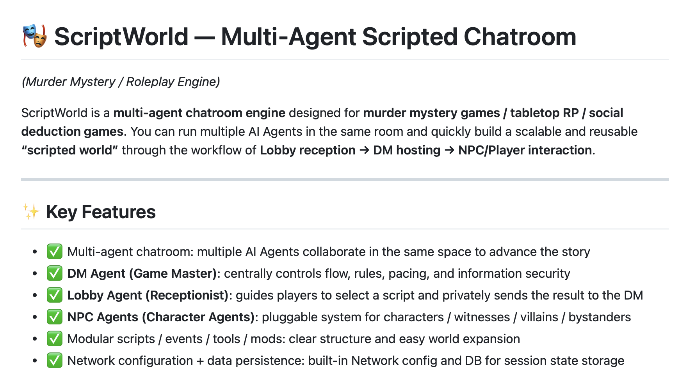
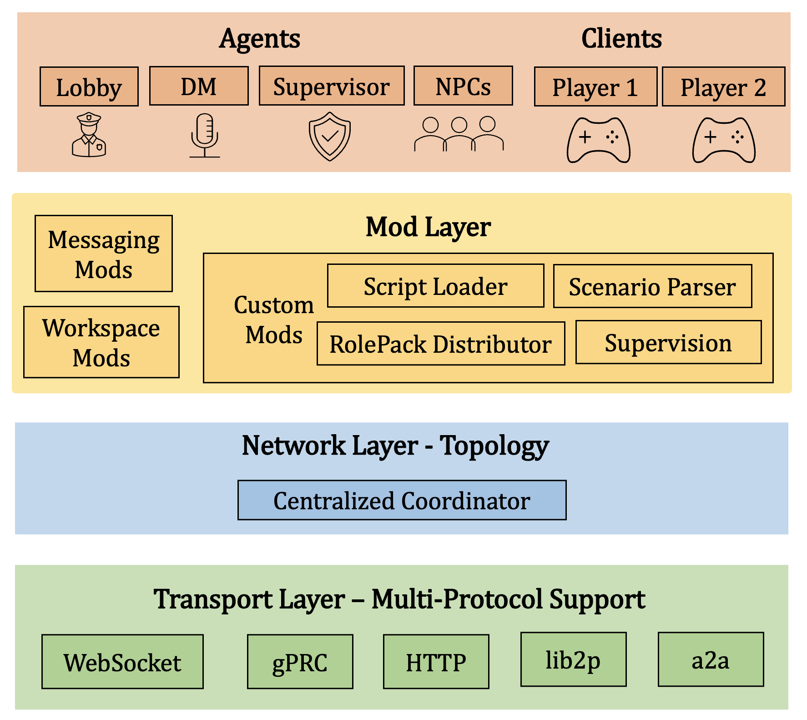
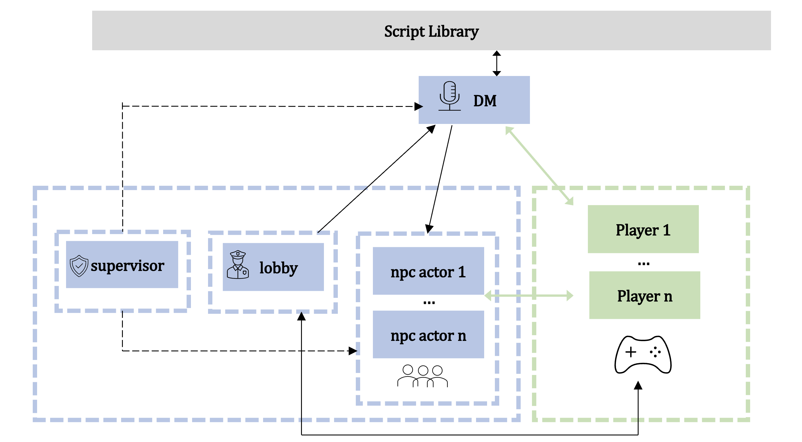

# 🎭 ScriptWorld — Multi-Agent Scripted Chatroom

*(Murder Mystery / Roleplay Engine)*

ScriptWorld is a **multi-agent chatroom engine** designed for **murder mystery games / tabletop RP / social deduction games**.
You can run multiple AI Agents in the same room and quickly build a scalable and reusable **“scripted world”** through the workflow of **Lobby reception → DM hosting → NPC/Player interaction**.

---

## ✨ Key Features

* ✅ Multi-agent chatroom: multiple AI Agents collaborate in the same space to advance the story
* ✅ **DM Agent (Game Master)**: centrally controls flow, rules, pacing, and information security
* ✅ **Lobby Agent (Receptionist)**: guides players to select a script and privately sends the result to the DM
* ✅ **NPC Agents (Character Agents)**: pluggable system for characters / witnesses / villains / bystanders
* ✅ Modular scripts / events / tools / mods: clear structure and easy world expansion
* ✅ Network configuration + data persistence: built-in Network config and DB for session state storage

---

## 🎯 Use Cases

ScriptWorld is suitable for:

* Building an **AI-driven murder mystery platform**
* Running **well-structured interactive roleplay / social deduction games**
* Conducting **multi-agent collaboration research** (reception → host → NPC group evolution)
* Rapidly creating and iterating on **worlds / scripts / characters**
* Serving as a **multi-agent scripted engine foundation** for more gameplay extensions

---

## 🎥Video Demonstration(Click the image to watch on Youtube 🔗)
https://youtu.be/kjzcFEUG21w
[](https://youtu.be/kjzcFEUG21w)


---

## 🧠 Architecture Overview

The core of ScriptWorld is a **Network**, which connects rooms, players, and various Agents.

!

---

### Core Modules

| Module         | Description                                            |
| -------------- | ------------------------------------------------------ |
| `network.yaml` | Defines chatroom network, rooms, and agent routing     |
| `agents/`      | Agent definitions: Lobby, DM, NPC                      |
| `scenarios/`   | Scenarios / worldbuilding / flow organization          |
| `events/`      | Event system: phase progression, clue distribution     |
| `tools/`       | Tools callable by Agents                               |
| `scripts/`     | Script content (cases, characters, clues, truth)       |
| `mods/`        | Optional extensions: custom rules and gameplay plugins |
| `network.db`   | Persistent storage (sessions, states, player data)     |

---

## 🧩 Built-in Agents (Default Agent System)

!

### 🎩 DM Agent (Universal Game Master)

File: `agents/dm.yaml`

The DM is the **host / referee / narrative engine** of the system, responsible for:

* Reading and understanding scripts (including DM-only truth)
* Assigning identities / character cards
* Maintaining rule consistency and handling exceptions
* Controlling pacing: opening → rounds → clues → discussion → voting → ending
* Information isolation: ensuring players only receive appropriate information

**Recommended configuration:**

* Lower `temperature` (stable progression)
* Higher `max_tokens` (long reasoning and guidance)
* Increased `reaction_delay` (more like a human host)

---

### 🛎 Lobby Agent (Receptionist)

File: `agents/lobby.yaml`

The Lobby works in the `#general` room and is responsible for:

* Guiding players through script selection / configuration

  * Number of players
  * Difficulty
  * Atmosphere (fun / serious / hardcore)
  * Duration
  * Theme
* **Privately sending the selection results to the DM**, who prepares and starts the game

Player experience flow:

> Player enters → Lobby guides script selection → DM starts the game → NPC / player deduction

---

### 🎭 NPC Agents (Character Agents)

Directory: `agents/npcs/`

NPC Agents can act as:

* Story characters / witnesses / bystanders
* Villains / conspirators
* “Fake players” in social deduction games

Plug-and-play support:
Simply add a new YAML file and configure routing in `network.yaml`.

---

## 🚀 Quick Start

### 1）Install OpenAgents (Python environment required)

```bash
pip install openagents
```

Verify installation:

```bash
openagents --version
```

---

### 2）Start the Network

```bash
conda activate openagents
cd script_world
openagents network start
```

Studio default address:

```
http://localhost:8700/studio/
```

---

### 3）Configure GLM-4.7 (Model Service)

#### 3.1 Create an API Key

Visit: [https://www.bigmodel.cn/](https://www.bigmodel.cn/)

#### 3.2 Configure the model in Studio

Path:

```
Service Proxy → Default Model Config
```

Fill in:

* Provider: Custom OpenAI Compatible
* Base URL: [https://open.bigmodel.cn/api/paas/v4](https://open.bigmodel.cn/api/paas/v4)
* Model Name: glm-4.7
* API Key: your key

Click **Test**. If successful, configuration is complete.

---

### 4）Start ScriptWorld Agents

```bash
openagents agent start agents/lobby.yaml
openagents agent start agents/dm.yaml
openagents agent start agents/npcs/npc_1.yaml
openagents agent start agents/npcs/npc_2.yaml
openagents agent start agents/npcs/npc_3.yaml
```

---

### 5）Start the Game

1. Enter Workspace → `#general`
2. Send `start`
3. Select and confirm a script
4. DM opens the game → NPCs / players begin deduction

---

## ⚙️ Configuration Guide

### Agent Configuration Example

```yaml
type: "openagents.agents.collaborator_agent.CollaboratorAgent"
agent_id: "dm"
display_name: "Universal DM"

config:
  model_name: "glm-4.7"
  temperature: 0.3
  max_tokens: 1500
  react_to_all_messages: false
  reaction_delay: "random(0.3, 1.2)"
  instruction: |
    You are the Game Master (DM) of a multi-agent murder mystery game.
    Your responsibilities include:
    - Reading and understanding the script (including DM-only truth)
    - Assigning roles and character cards to players
    - Maintaining rules consistency and handling exceptions
    - Controlling game pacing: opening → rounds → clues → discussion → voting → ending
    - Ensuring players only receive information they are supposed to know

    Always act in a way that maintains suspense and fairness for all players.
```

### Directory Structure

```text
script_world/
├─ agents/
│  ├─ dm.yaml
│  ├─ lobby.yaml
│  └─ npcs/
├─ scripts/
├─ scenarios/
├─ events/
├─ tools/
├─ mods/
├─ logs/
├─ network.yaml
└─ network.db
```

### Data Persistence

- `network.db`: stores session states and player data
- `logs/`: runtime logs and game replays

### Adding a New Agent

1. Create a new YAML file under `agents/`
2. Set a unique `agent_id`
3. Configure the routing for the agent in `network.yaml`

### Creating a New Script

1. Create a new folder under `scripts/<your_script_name>/`
2. Include:
   - World background / setting
   - Character cards
   - Timeline of events
   - Clues per round
   - DM-only truth (in a separate file)

### FAQ

**Agent does not respond:**
- Check `network.yaml` for correct configuration
- Inspect `logs/` for errors

**Agent outputs too diverging:**
- Reduce `temperature`
- Increase `max_tokens`

### Security Recommendations

- Add DM boundaries when scripts contain sensitive content
- Apply safety filters for tools
- Avoid storing sensitive personal information

